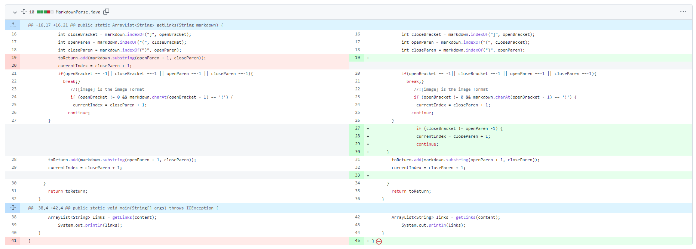

# Lab Report 2

### Codeing change No.1


Failure-inducing input 1: [testing1](https://github.com/TerryYan26/markdown-parser/blob/84ba72b5700c3a1070430f18d00669ea3d043427/testing1.md)


Here is the fail testing output:
```
Exception in thread "main" java.lang.OutOfMemoryError: Java heap space
        at java.base/java.lang.StringLatin1.newString(StringLatin1.java:769)
        at java.base/java.lang.String.substring(String.java:2709)
        at MarkdownParse.getLinks(MarkdownParse.java:19)
        at MarkdownParse.main(MarkdownParse.java:36)
```
screenshot of the code change different:

The bug is that in MarkdownParse.java. Since we use a while loop and length for the condition.  When we don't have more URLs but they have another text in the markdown file. It will cause symptoms that the program can compile but when it was running having error.


---
### Codeing change No.2
\
Failure-inducing input 2: [testing2](https://github.com/TerryYan26/markdown-parser/blob/84ba72b5700c3a1070430f18d00669ea3d043427/testing2.md)


Here is the fail testing output:
```
[https://something.com]
```
screenshot of the code change different:

The bug is about the output including image files but it is not a URL. The symptom is when we run a program we will get the URLs of the links and the image format.
### Codeing change No.3

Failure-inducing input 3: [testing3](https://github.com/TerryYan26/markdown-parser/blob/84ba72b5700c3a1070430f18d00669ea3d043427/testing3.md)


Here is the fail testing output:
```
Exception in thread "main" java.lang.StringIndexOutOfBoundsException: begin 0, end -1, length 43
        at java.base/java.lang.String.checkBoundsBeginEnd(String.java:4601)
        at java.base/java.lang.String.substring(String.java:2704)
        at MarkdownParse.getLinks(MarkdownParse.java:19)
        at MarkdownParse.main(MarkdownParse.java:39)
```
screenshot of the code change different:


The bug that when markdown has any links and it will start starting index is -1. it will cause an index exception. Causing IndexOutOfBoundsException as a symptom.
