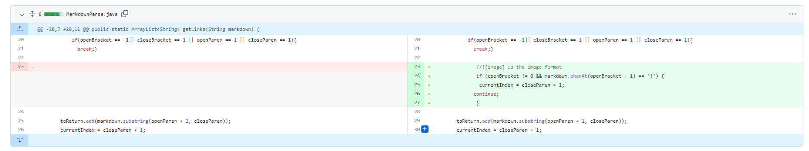

# Lab Report 2

### Codeing change No.1


Failure-inducing input 1: [testing1](https://github.com/TerryYan26/markdown-parser/blob/087e507db8671a80f9b123bd9d88e5fd141dfe6b/testing1.md)


Here is the fail testing output:
```
Exception in thread "main" java.lang.OutOfMemoryError: Java heap space
        at java.base/java.lang.StringLatin1.newString(StringLatin1.java:769)
        at java.base/java.lang.String.substring(String.java:2709)
        at MarkdownParse.getLinks(MarkdownParse.java:19)
        at MarkdownParse.main(MarkdownParse.java:36)
```
screenshot of the code change different:

The bug is that in MarkdownParse.java. Since we use a while loop and length for the condition.  When we don't have more URLs but they have another text in the markdown file. It will cause symptoms that the program can compile but when it was running having error.


---
### Codeing change No.2
\
Failure-inducing input 2: [testing2](https://github.com/TerryYan26/markdown-parser/blob/087e507db8671a80f9b123bd9d88e5fd141dfe6b/testing2.md)
\
\

Here is the fail testing output:
```
[https://something.com]
```
screenshot of the code change different:


### Codeing change No.3
\
Failure-inducing input 3: 
\
\

Here is the fail testing output:
```

```
screenshot of the code change different:


