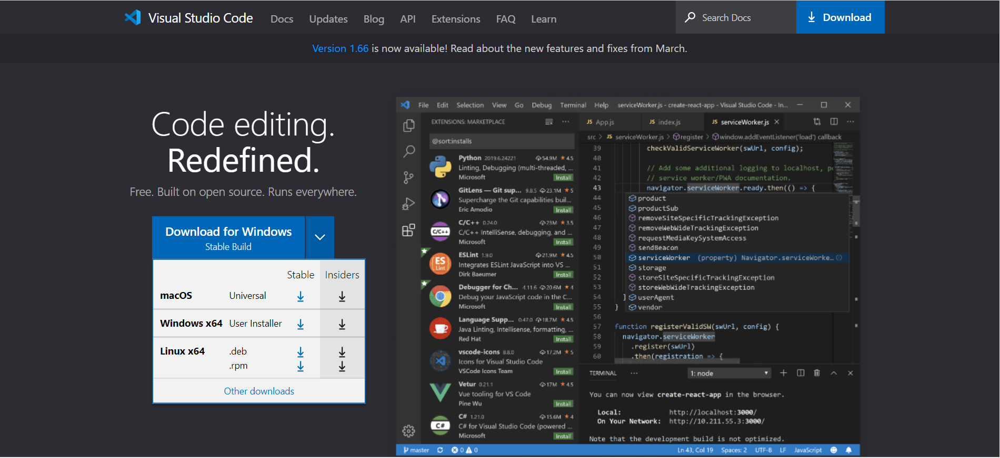
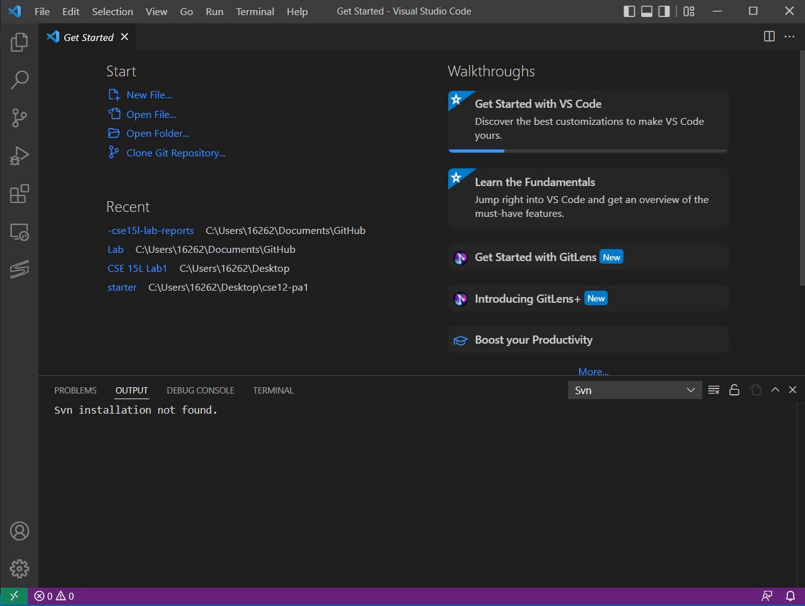
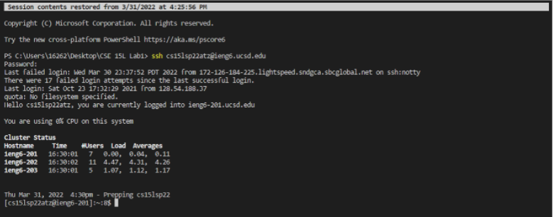
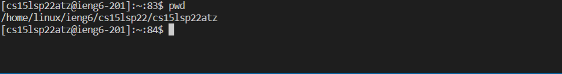
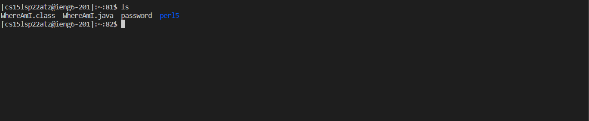
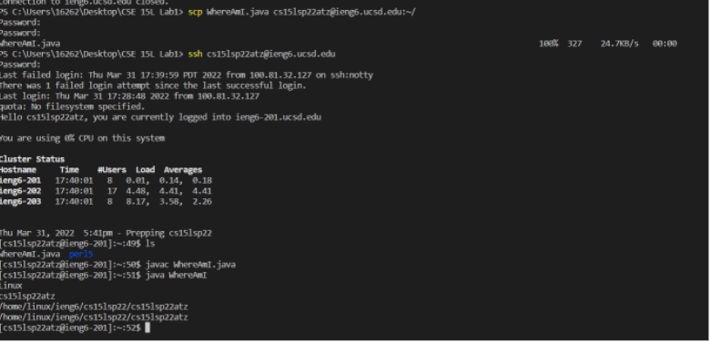
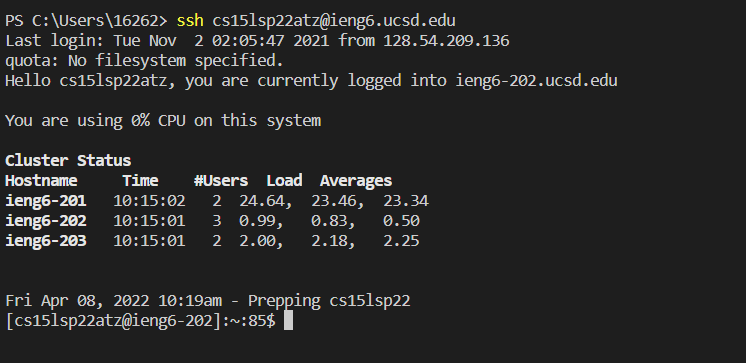
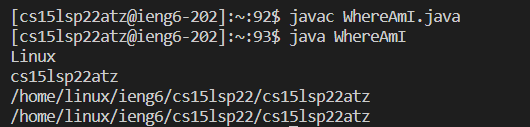

# Lab Report

## Installing VScode
  1. Go to google searching "VSCode" or [Click Here](https://code.visualstudio.com/).
  2. Select your platforms(Window , MacOs)
  
  3. Download your platforms version and install it.
  4. When you done for the install. Your VsCode interface like that
  
## Remotely Connecting
1. Go to install the OpenSSH. [Click Here](https://docs.microsoft.com/en-us/windows-server/administration/openssh/openssh_install_firstuse) to install OpenSSH
2. Getting your CSE15L account from:[Here](https://sdacs.ucsd.edu/~icc/index.php).
3. Then, Going to the VsCode and  open a terminal in VSCode (Ctrl + `, or use the Terminal → New
Terminal menu option). Your command will look like this, but with the **zz** replaced by the
letters in your course-specific account.
4. enter the command in your VScode : `$ ssh cs15lsp22zz@ieng6.ucsd.edu`
5. If you are first time to login, here is the message you will see :
    `$ ssh cs15lsp22zz@ieng6.ucsd.edu`
  `" The authenticity of host 'ieng6.ucsd.edu (128.54.70.227)' can't be established."`
  `Are you sure you want to continue connecting (yes/no/[fingerprint])?`
6. Type "yes" and enter.
7. Here is the message you will see:

## Trying Some Commands
1. Here is some Commands for testing.
2.  <mark>Pwd </mark>  and  <mark>ls </mark>
3.  <mark>Pwd </mark> is a command that shows the current directory.
  Here is picture for enter command Pwd :
 
4.  <mark>ls </mark> is a command that shows a directory listing.
  Here is a picture for enter a command  <mark>ls </mark>:
  
   

## Moving Files with scp
1. When we want to move file form local computer to remote computer, we have to use command call  <mark>scp </mark>
2. Make sure we are not login the remote compurter.(If we are in the remote computer, use command  <mark>exit </mark>. 
3. Then you will logout it and get the message: `Connection to ieng6<zz>.ucsd.edu closed.`
4. Enter you command in your VScode terminal : `$ scp <file name> cs15lsp22<zz>@ieng6.ucsd.edu:~/`
5. Then login your account: `$ ssh cs15lsp22<zz>@ieng6.ucsd.edu` and use  <mark>ls </mark> 
6. You can see your uploading file.
   Here am I using `WhereAMI.java` be the example and you will see the result below:
  

## Setting an SSH Key
1. Use `$ ssh cs15lsp22<zz>@ieng6.ucsd.edu` login to remote computer.
2. Create  <mark>.ssh </mark> in the remote computer.
3. exit the remote computer.
4. Enter  <mark>ssh-keygen </mark> and some message show below
  `# on client (your computer) `
  `$ ssh-keygen `
  `Generating public/private rsa key pair. `
  `Enter file in which to save the key `
  `(/Users/<user-name>/.ssh/id_rsa): /Users/<user-name>/.ssh/id_rsa `
  `Enter passphrase (empty for no passphrase): `
5. You can use easy passphrase to replace the password or just enter.
6. Then enter again for comfirm and there is the message to show : The key's randomart image is:
 `+---[RSA 3072]----+`
 `|                 |`
 `|   . . + .       |`
 `| . . B o .       |`
 `| . . B * +..     |`
 `| o S = *.B.      |`
 `| = = O.*.*+      |`
 `| + * *.BE+       |`
 `| +.+.o           |`
 `|              .. |`
 `+----[SHA256]-----+`
7. use `$ scp id_rsa.pub cs15lsp22<zz>@ieng6.ucsd.edu:~/.ssh/authorized_keys`. Then you will auto login to remote computer.
  
  
## Optimizing Remote Running
1. Since we have already upload `WhereAmI.java`.
2. `$ ssh cs15lsp22zz@ieng6.ucsd.edu`, then enter <mark>ls</mark> to list out the file.
3. Enter command`$ javac WhereAmI.java` and `$ java WhereAmI`.
4. Then the java programe is running in the remote computer.
    

