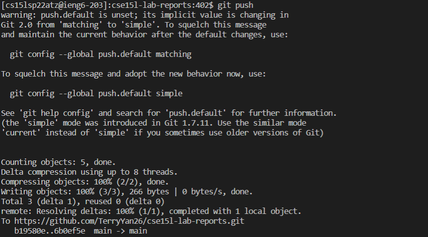

# Lab Report

### Streamlining ssh Configuration
When we log in to the remote computer, it has a lot of steps to do. So, we want to simplify the step in this section. We can use the `.ssh/config` file to store our command. In the future, we don’t need to connect to ieng6 which uses ` $ ssh cs15lsp22___@ieng6.ucsd.edu` and we only use the command `ssh ieng6`. 
- Using command `~/.ssh/config` and then you can choose Notepad to open this file and edit it :
```
Host ieng6
    HostName ieng6.ucsd.edu
    User cs15lsp22zzz (use your username)
    IdentityFile ~/.ssh/id_rsa
```

- Saving this file and exit. When we complete the edit, we can use ieng6 to repalce cs15lsp22___@ieng6.ucsd.edu since ieng6 is our host name.
- log in with command `ssh ieng6` and it will success and it look like this:

- Using `scp` with the `ieng6`, we can use that to copy files from our local computer to the remote. There is an example using MarkdownParse.java to upload form local to remote.

### Setup Github Access from ieng6
- When we push and commit from the remote server, we have to store our public key in Github account. Since I save a public key (authorized_keys)in the remote server in .ssh. So we can get the public key in my remote server. Here is the directory:
 
- We get the public key and we go to github setting and select SSH and GPG keys, click New SSH key and paste your pulbic key in side:

-Also, we should save a private key(id_rsa) and public key(id_rsa.pub) in our computer and here is the directory:

- Here is the meassage when we push the file:

- Here is the [commit](https://github.com/TerryYan26/cse15l-lab-reports/commit/6b0ef5eda64c0b3179733a49f61842560127c47f)

## Copy whole directories with `scp -r`
- When we need to copy a full file to the remote. we can use a command `scp -r`. Here is the screenshot:


