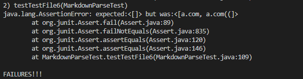
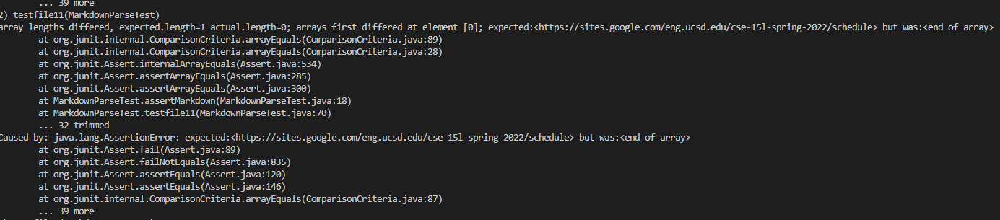

# Lab Report 4 - Week 8
# Two markdown-parser


[Our markdown-parser](https://github.com/TerryYan26/markdown-parser.git)

[Reviewed markdown-parse](https://github.com/rmccrystal/markdown-parser.git)

# Snippet 1

```
`[a link`](url.com)

[another link](`google.com)`

[`cod[e`](google.com)

[`code]`](ucsd.edu)
```

Here is the  the CommonMark demo site produce:

The markdown-parse should be output:

``` 
[`google.com, google.com, ucsd.edu] 
```
We have to set up a test in Junit:

### Our test: 


Setting up a variable:

```
 private Path fileName5;
 private String content5;
 private ArrayList<String> links5;
 
 ```
 
Writting a structures for the test in `public void setUp() throws IOException:`

```
fileName5 = Path.of("Snippet1.md");
content5 = Files.readString(fileName5);
links5 = new ArrayList<String>();

```

Setting up a test:

```

  @Test
    public void testTestFile5() {
        links5.add("`google.com");
        links5.add("google.com");
        links5.add("ucsd.edu");
       
        assertEquals(links5, MarkdownParse.getLinks(content5));
        
  ```
  
  
Test result: Failures


### Reviewed test:
  
  
 Adding a test:
 ```
  @Test
    public void testfile9(){
        assertMarkdown(Path.of("Snippet1.md"), List.of("`google.com", "google.com", "ucsd.edu"));
    }
    
 ```
 Test result: Failures
 
 
 
### Question response Snippet 1 :
 
Yes, It can be a small (<10 lines) code change.We may use if statement to check when the first character is equal to the open backticks. It will print out that. Otherwise, it will not print.


# Snippet 2

```
[a [nested link](a.com)](b.com)

[a nested parenthesized url](a.com(()))

[some escaped \[ brackets \]](example.com)

```

Here is the  the CommonMark demo site produce:

The markdown-parse should be output:
``` 
[a.com, a.com(()), example.com]
```
We have to set up a test in Junit:

## Our test: 

Setting up a variable:
```
 private Path fileName6;
 private String content6;
 private ArrayList<String> links6;
 ```
Writting a structures for the test in `public void setUp() throws IOException:`
```
fileName6 = Path.of("Snippet2.md");
content6 = Files.readString(fileName6);
links6 = new ArrayList<String>();
```
Setting up a test:

```

  @Test
    public void testTestFile6() {
        links6.add("a.com");
        links6.add("a.com(())");
        links6.add("example.com");
       
        assertEquals(links6, MarkdownParse.getLinks(content6));
        
  ```
Test result: Failures


  ## Reviewed test:
  
Adding a test:
 ```
  @Test
    public void testfile10(){
        assertMarkdown(Path.of("Snippet2.md"), List.of("`google.com", "google.com", "ucsd.edu"));
    }
    
 ```
Test result: Failures
 
 
### Question response Snippet 2 :
 
 It seems like bigger than 10 lines. If we want to solve snippet2, we may use stack and create the stack structure. we have to trace the '(' and pop the data after ')'. It may fix that bug.


# Snippet 3

```
[this title text is really long and takes up more than 
one line

and has some line breaks](
    https://www.twitter.com
)

[this title text is really long and takes up more than 
one line](
https://sites.google.com/eng.ucsd.edu/cse-15l-spring-2022/schedule
)


[this link doesn't have a closing parenthesis](github.com

And there's still some more text after that.

[this link doesn't have a closing parenthesis for a while](https://cse.ucsd.edu/


)

And then there's more text

```

Here is the  the CommonMark demo site produce:

The markdown-parse should be output:
``` 
[https://sites.google.com/eng.ucsd.edu/cse-15l-spring-2022/schedule]
```
We have to set up a test in Junit:

## Our test: 

1. Setting up a variable:
```
 private Path fileName7;
 private String content7;
 private ArrayList<String> links7;
 ```
 2. Writting a structures for the test in `public void setUp() throws IOException:`
```
fileName7 = Path.of("Snippet3.md");
content7 = Files.readString(fileName7);
links7 = new ArrayList<String>();
```
3. Setting up a test:

```

  @Test
    public void testTestFile7() {
        links7.add("https://sites.google.com/eng.ucsd.edu/cse-15l-spring-2022/schedule");
       
       
        assertEquals(links7, MarkdownParse.getLinks(content7));
        
  ```
4. Test result: Failures


## Reviewed test:
  
  
  1. adding a test:
 ```
  @Test
    public void testfile11(){
        assertMarkdown(Path.of("Snippet3.md"), List.of("https://sites.google.com/eng.ucsd.edu/cse-15l-spring-2022/schedule");
    }
    
 ```
 2. Test result: Failures
 
 
### Question response Snippet 3 :
 
 
 It seems like bigger than 10 lines. the case seem like we have to set up one if statement to stop the line break, second we have to trace '(' and ')'. Third we have to check that the URL can not exist space in the beginning.
 
