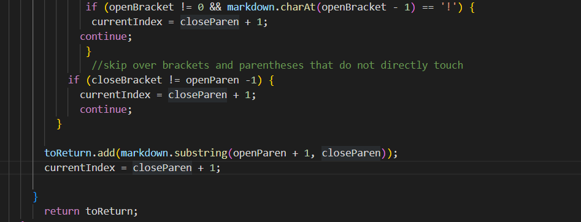
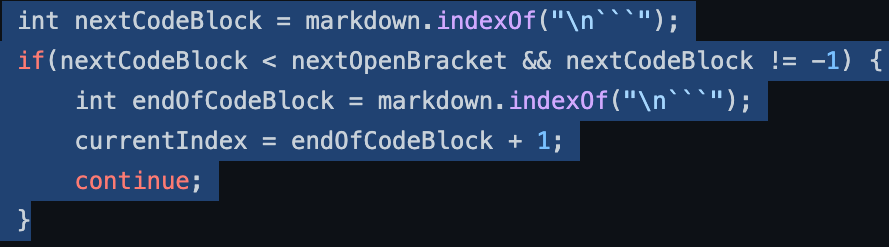
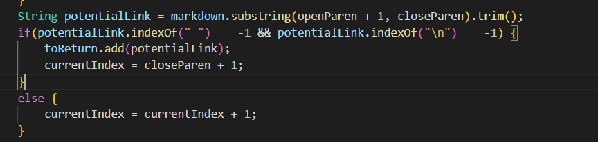

# Lab Report 5 - Week 10

##  `vimdiff` in two different MarkdownParse.java

In the Lab, we are using a different MarkdownParse which one is our own `MarkdownParse.java` and another is provided `MarkdownParse.java`.And we are print out the output in `result.txt` and Using `vimdiff` to compare two `result.txt`.
```
vimdiff /home/linux/ieng6/cs15lsp22/cs15lsp22atz/test-file/markdown-parser/results.txt /home/linux/ieng6/cs15lsp22/cs15lsp22atz/markdown-parser/results.txt

```

Here is some of the example when we are execute the `vimdiff` command(left is provided, right is own):


You can see that here is the different to show red color: `194.md`, `201.md`.
We search through manually but it also can be auto this process such as add a command in the `script.sh`.

## 194.md
[the CommonMark demo site](https://spec.commonmark.org/dingus/) to show that the correct answer is url, so provided is correct.
The reason of my own  `MarkdownParse.java` is ` ` because it has some wrong code:

Since it doesn't pass any if statment so it only return back toReturn.
So it may add some method like:

it may fix this bug.

## 201.md

[the CommonMark demo site](https://spec.commonmark.org/dingus/) to show that the correct answer is [], so my own is correct.
The reason of provided `MarkdownParse.java` is `baz` because it has some wrong code:

Since `indexOf(" ") == -1` and it still have a space exist after the begining so the code isn't run and cause the problem.
