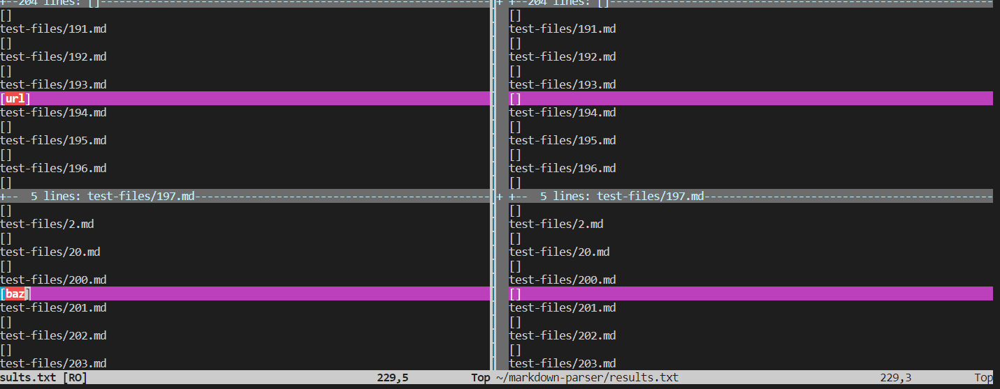
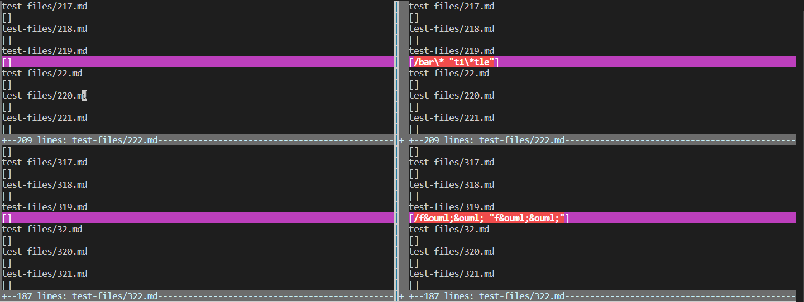

# Lab Report 5 - Week 10

##  `vimdiff` in two different MarkdownParse.java

In the Lab, we are using a different MarkdownParse which one is our own `MarkdownParse.java` and another is provided `MarkdownParse.java`.And we are print out the output in `result.txt` and Using `vimdiff` to compare two `result.txt`.
```
vimdiff /home/linux/ieng6/cs15lsp22/cs15lsp22atz/test-file/markdown-parser/results.txt /home/linux/ieng6/cs15lsp22/cs15lsp22atz/markdown-parser/results.txt

```

Here is some of the example when we are execute the `vimdiff` command:




You can see that here is the different to show red color: `193.md`, `200.md`, `219.md`, `319.md`.
We search through manually but it also can be auto this process such as add a command in the `script.sh`.
